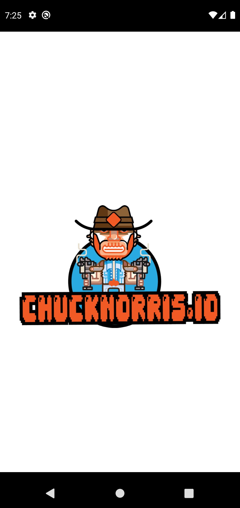
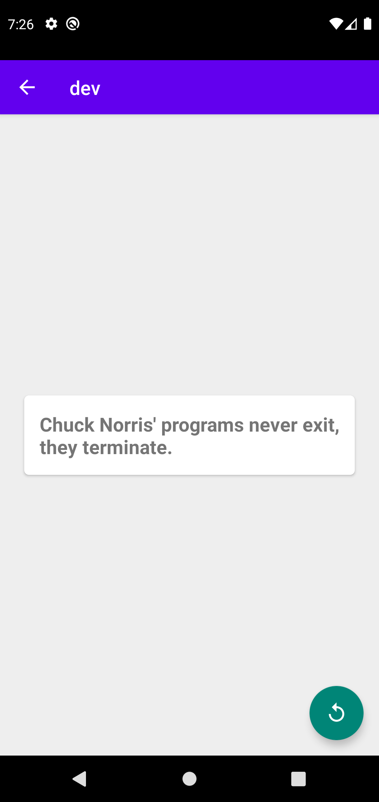

# Chuck Norris IO joke app
 Android study to improve knowledge on Recycler View, Constraint Layout, Java, http requests with retrofit,
 permissions, api's, MVP pattern, splash screens, etc.

# :pushpin: Table of Contents

* [Features](#brain-features)
* [Technologies](#computer-technologies)

# :brain: Features

* List jokes categories
* Read random joke
* Generate Random joke

# :computer: Technologies

* Android
* Java
* Retrofit
* XML
